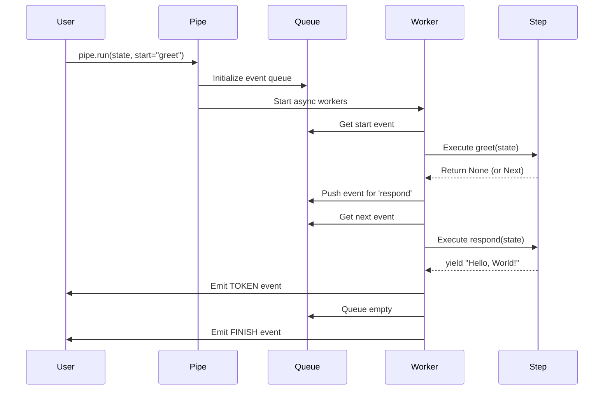
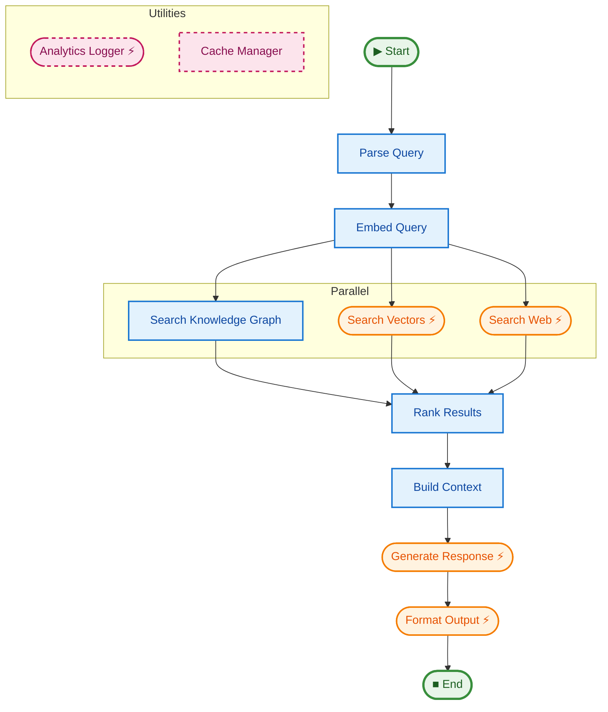

# justpipe

[](https://github.com/plar/justpipe/actions/workflows/ci.yml)
[](https://github.com/plar/justpipe/actions)
[](https://pypi.org/project/justpipe/)

Your code is the graph. Async, streaming pipelines for AI.

## Installation

```bash
pip install justpipe

# With retry support (tenacity)
pip install "justpipe[retry]"
```

## Quick Start

[View Example Code](examples/01_quick_start)

```python
import asyncio
from dataclasses import dataclass
from justpipe import Pipe, EventType

@dataclass
class State:
    message: str = ""

# Type-safe pipeline definition
pipe = Pipe(State)

@pipe.step()
async def respond(state: State):
    yield f"{state.message}, World!"

@pipe.step(to=respond)
async def greet(state: State):
    state.message = "Hello"

async def main():
    state = State()
    async for event in pipe.run(state):
        if event.type == EventType.TOKEN:
            print(event.payload)  # "Hello, World!"

asyncio.run(main())
```

## Understanding justpipe

Before diving into features, let's understand how justpipe works under the hood.

### Decorators: Registration vs. Execution

**Key insight:** Decorators register steps into a graph. Execution happens later when you call `pipe.run()`.

**The `to=` parameter accepts two styles:**

#### 1. String reference (forward references allowed)
```python
@pipe.step(to='respond')  # ✓ String - can reference steps defined later
async def greet(state):
    state.message = "Hello"

@pipe.step()  # Defined after, but works fine
async def respond(state):
    yield f"{state.message}, World!"
```

#### 2. Function reference (must be defined first)
```python
@pipe.step()  # ✓ Define first
async def respond(state):
    yield f"{state.message}, World!"

@pipe.step(to=respond)  # Then reference the function object
async def greet(state):
    state.message = "Hello"
```

**What happens:**
1. Python runs decorators top-to-bottom at import time
2. Each `@pipe.step()` registers a step in the graph
3. The `to=` parameter can be:
   - **String** (`'respond'`) - resolved later, allows forward references
   - **Function** (`respond`) - requires the function to exist at decoration time
   - **List** (`['step1', 'step2']` or `[step1, step2]`) - for multiple targets
4. When `pipe.run()` executes, it follows the graph topology, not definition order

**Definition freeze:** After the first successful `pipe.run()` setup, pipeline
definition is frozen. Adding steps, middleware, hooks, or observers raises
`RuntimeError`. Create a new `Pipe` instance to reconfigure.

**Think of it like wiring:** You're connecting components (steps) with wires (`to=` parameters). The actual electricity (data flow) comes later.

**Pro tip:** Use strings for flexibility, functions for IDE autocomplete and refactoring support.

### The Execution Model

When you call `pipe.run(state)`, here's what happens:



**Key points:**
- Steps execute **asynchronously** via an event-driven queue
- Parallel steps (fan-out) run concurrently
- Implicit barriers wait for all branches before continuing
- Events (`STEP_START`, `TOKEN`, `FINISH`) stream back to you

### Dependency Injection

justpipe auto-injects parameters based on **type** or **name**:

```python
# Example: Map step spawns workers with injected items
@pipe.step("worker")
async def process_item(
    state: State,      # ← Injected by type annotation
    ctx: Context,      # ← Injected by type annotation
    item: str,         # ← Injected by name (from the mapper below)
):
    # state, ctx, and item are all automatically provided
    print(f"Processing: {item}")
    state.results.append(item.upper())

@pipe.map(each="worker")
async def create_tasks(state: State):
    # This spawns 'worker' step for each item returned
    return ["apple", "banana", "cherry"]
    # Each item is injected as the 'item' parameter in process_item
```

**Resolution order:**
1. **Type-based**: `state: State` → injects pipeline state
2. **Type-based**: `ctx: Context` → injects pipeline context
3. **Name-based**: Special parameters like `item` (from `@map`), `error` (from `on_error`)

**No magic matches?** You'll get a clear error at registration time.

### State Mutation & Concurrency

justpipe uses **mutable state** by design:

```python
@dataclass
class State:
    count: int = 0

@pipe.step()
async def increment(state: State):
    state.count += 1  # ← Direct mutation
```

**Why mutation?**
- Simpler than immutable patterns
- Matches Python's dataclass idioms
- Efficient for large state objects

**Concurrency safety:**
- **Sequential steps**: ✅ Safe - one step runs at a time
- **Parallel branches (separate fields)**: ✅ Safe - each branch mutates different attributes
- **Concurrent workers (same fields)**: ⚠️ **UNSAFE** - race conditions without locking!

```python
# ✅ SAFE: Parallel branches modify DIFFERENT fields
@pipe.step(to='combine')
async def branch_a(state):
    state.a = 10  # ← Branch A modifies 'a'

@pipe.step(to='combine')
async def branch_b(state):
    state.b = 20  # ← Branch B modifies 'b'

@pipe.step()
async def combine(state):
    print(state.a + state.b)  # 30 - both mutations preserved

# ⚠️ UNSAFE: Map workers modify SAME field
@pipe.map(each="worker")
async def create_workers(state):
    return range(10)

@pipe.step("worker")
async def worker(state, item: int):
    state.counter += 1  # RACE CONDITION! Lost updates likely
```

**For concurrent mutations to shared state, you need locking.** See the [Concurrency Guide](docs/advanced/concurrency.md) for safe patterns.

### The `to=` Parameter: Polymorphic Routing

The `to=` parameter is **context-aware** across decorators:

| Decorator | `to=` accepts | Meaning |
|-----------|---------------|---------|
| `@pipe.step(to=...)` | `str`, `function`, `[...]` | Next step(s) to execute |
| `@pipe.map(to=...)` | `str`, `function`, `[...]` | Step(s) after all mapped items |
| `@pipe.switch(to=...)` | `dict`, `callable` | Routing table or decision function |
| `@pipe.sub(to=...)` | `str`, `function`, `[...]` | Step(s) after sub-pipeline |

**Why overload `to=`?**
Conceptual consistency: it always answers *"where do we go next?"*

**Example: Switch routing**
```python
@pipe.switch(to={
    "success": handle_success,   # ← Dict maps return values to steps
    "failure": "handle_failure",  # ← Mix functions and strings
})
async def check_status(state) -> str:
    return "success" if state.ok else "failure"
```

### Event Stream

`pipe.run()` returns an async generator of events:

```python
async for event in pipe.run(state):
    match event.type:
        case EventType.STEP_START:
            print(f"Starting {event.stage}")
        case EventType.TOKEN:
            print(f"Streamed: {event.payload}")
        case EventType.STEP_ERROR:
            print(f"Error in {event.stage}: {event.payload}")
        case EventType.FINISH:
            print("Pipeline complete")
```

**Why events?**
- Observe progress in real-time
- Stream LLM tokens as they arrive
- Debug failures with context

**Common pattern:** Filter events you care about, ignore the rest.

Run lineage fields:
- `event.run_id`: Current stream/root run ID (stable for one `pipe.run(...)`).
- `event.origin_run_id`: Run where this event was originally produced.
- `event.parent_run_id`: Immediate parent run that forwarded this event (or `None`).

### Mental Model Summary

Think of justpipe as:
- **Declarative graph builder** (decorators wire the topology)
- **Async executor** (event-driven worker pool)
- **Type-safe DI container** (auto-injects dependencies)
- **Observable stream** (events flow back to you)

If this makes sense, you're ready to explore the features below. If not, check out the [examples](examples/) for concrete patterns.

## Features

- **Code-as-Graph** - Define complex workflows using simple decorators (`@step`, `@map`, `@switch`, `@sub`).
- **Type-Safe** - Full generic type support with `Pipe(State, Context)` and type annotations for static analysis.
- **Visualization** - Generate beautiful Mermaid diagrams with `pipe.graph()`.
- **Resilience** - Built-in backpressure, retries, and timeouts.
- **Async & Streaming** - Native `asyncio` support with generator streaming.
- **Zero dependencies** - Core library is lightweight (dependencies only for extras).
- **Parallel execution** - Fan-out with implicit barrier synchronization.
- **Validated** - Graph integrity checks (cycles, broken references) with `pipe.validate()`.



## Parallel Execution (DAG)

[View Example Code](examples/02_parallel_dag)

Static parallelism is defined by linking one step to multiple targets. Use `barrier_timeout` to prevent the pipeline from hanging if a parallel branch fails silently.

```python
@pipe.step(barrier_timeout=5.0)
async def combine(state):
    # Implicit Barrier: Runs only after BOTH fetch_a and fetch_b complete
    state.result = state.a + state.b

@pipe.step(to=combine)
async def fetch_a(state):
    state.a = await fetch_from_api_a()

@pipe.step(to=combine)
async def fetch_b(state):
    state.b = await fetch_from_api_b()

@pipe.step(to=[fetch_a, fetch_b])
async def start(state):
    pass
```

## Dynamic Parallelism (Map)

[View Example Code](examples/03_dynamic_map)

Use `@pipe.map` to process a list of items in parallel. The decorated function must return an iterable.

```python
@pipe.step("worker")
async def worker(item: int, state):
    # 'item' is injected automatically because it's not a state/context arg
    print(f"Processing {item}")

@pipe.map(each=worker)
async def process_batch(state):
    # Spawns 'worker' step for each item in the returned list
    return [1, 2, 3]
```

## Dynamic Routing (Switch)

[View Example Code](examples/04_dynamic_routing)

Use `@pipe.switch` to route execution based on the return value.

```python
@pipe.step("positive_handler")
async def handle_pos(state): ...

@pipe.step("negative_handler")
async def handle_neg(state): ...

@pipe.switch(to={
    "pos": "positive_handler", 
    "neg": "negative_handler"
})
async def decide(state) -> str:
    return "pos" if state.value > 0 else "neg"
```

Alternatively, any step can simply return the name of the next step (as a string) to jump dynamically.

## Suspension

[View Example Code](examples/05_suspension_resume)

Use `Suspend` to pause execution. The event stream will yield a `SUSPEND` event and then stop.

```python
from justpipe import Suspend

@pipe.step("validate")
async def validate(state):
    if not state.is_ready:
        return Suspend(reason="wait_for_human")
```

## Sub-pipelines (Composition)

[View Example Code](examples/06_subpipelines)

Compose complex workflows by running other pipelines as steps.

```python
sub_pipe = Pipe()
# ... define sub_pipe steps ...

@pipe.sub("execute_sub", pipeline=sub_pipe)
async def delegate(state):
    # Pass the state (or a transformation of it) to the sub-pipeline
    return state
```

## Streaming Tokens

[View Example Code](examples/07_streaming)

```python
@pipe.step("stream")
async def stream(state):
    for chunk in generate_response():
        yield chunk  # Yields TOKEN events
```

## Reliability & Retries

[View Example Code](examples/08_reliability_retry)

justpipe has built-in support for `tenacity` if installed.

```bash
pip install "justpipe[retry]"
```

```python
@pipe.step("flaky_api", retries=3, retry_wait_min=0.1)
async def flaky_api(state):
    # Will automatically retry on exception
    response = await unreliable_api_call()
```

## Backpressure

Protect your application from memory exhaustion by limiting the event queue size. When the queue is full, producer steps will automatically block.

```python
# Set a global limit for the pipe
pipe = Pipe(queue_size=100)

# Or override it at runtime
async for event in pipe.run(state, queue_size=10):
    ...
```

## Middleware

[View Example Code](examples/09_middleware)

Middleware wraps every step execution. Useful for logging, tracing, or error handling.

```python
from justpipe import simple_logging_middleware, StepContext

pipe.add_middleware(simple_logging_middleware)

def custom_middleware(func, ctx: StepContext):
    async def wrapped(**kwargs):
        print(f"Entering {ctx.name}")
        return await func(**kwargs)
    return wrapped
```

## Lifecycle Hooks

[View Example Code](examples/10_lifecycle_hooks)

Hooks are useful for managing external resources like database connections or API clients.
Hooks use the same dependency-injection rules as steps, so you can type or name parameters for state/context.

```python
@pipe.on_startup
async def setup(context):
    context.db = await connect_to_database()

@pipe.on_shutdown
async def cleanup(context):
    await context.db.close()
```

## Visualization & Introspection

[View Example Code](examples/11_visualization)

Inspect registered steps or generate Mermaid diagrams.

```python
# Generate Mermaid graph
print(pipe.graph())

# Programmatic introspection
for step in pipe.steps():
    print(f"{step.name} -> {step.targets}")
```

## Error Handling

Define how to recover from failures at the step or pipeline level.

```python
from justpipe import Retry, Skip

# 1. Step-level handler
async def handle_api_error(error, state):
    return Retry() if isinstance(error, TransientError) else Skip()

@pipe.step(on_error=handle_api_error)
async def call_api(state):
    ...

# 2. Global handler
@pipe.on_error
async def global_handler(error, state, step_name):
    print(f"Global catch: {step_name} failed with {error}")
```

## Testing Harness

[View Example Code](examples/14_testing_harness) | [Read the Guide](docs/testing/harness.md)

justpipe includes a specialized `TestPipe` harness to make writing unit tests for your workflows simple and expressive. It handles mocking, event inspection, and automatic restoration of your pipeline.

```python
from justpipe import Pipe, TestPipe

with TestPipe(pipe) as tester:
    # Mock a step
    mock_notify = tester.mock("notify_user")
    
    # Run pipeline
    result = await tester.run(initial_state)
    
    # Assertions
    mock_notify.assert_called_once()
    assert result.was_called("fetch_data")
    assert result.final_state.is_done
```

## Terminal Semantics

Completed runtime paths end with `EventType.FINISH` carrying a structured payload:

```python
from justpipe.types import PipelineEndData, PipelineTerminalStatus

async for event in pipe.run(state, timeout=1.0):
    if event.type == EventType.FINISH:
        end: PipelineEndData = event.payload
        if end.status is PipelineTerminalStatus.SUCCESS:
            ...
        elif end.status is PipelineTerminalStatus.TIMEOUT:
            ...
        elif end.status is PipelineTerminalStatus.FAILED:
            print(end.failure_kind, end.failure_source, end.failed_step)
            ...
```

Top-level statuses: `SUCCESS`, `FAILED`, `TIMEOUT`, `CANCELLED`, `CLIENT_CLOSED`.

Failure diagnostics are attached as structured fields on `PipelineEndData`:
- `failure_kind` (`none|validation|startup|step|shutdown|infra`)
- `failure_source` (`none|user_code|framework|external_dep`)
- `failed_step`
- `errors` (full failure chain)

You can customize `failure_source` classification:

```python
from justpipe import Pipe
from justpipe.types import (
    FailureClassificationConfig,
    FailureClassificationContext,
    FailureSource,
)

def classify_source(ctx: FailureClassificationContext) -> FailureSource | None:
    if ctx.kind.value == "step" and ctx.step == "call_llm":
        return FailureSource.EXTERNAL_DEP
    return None  # keep framework default

pipe = Pipe(
    State,
    failure_classification=FailureClassificationConfig(
        source_classifier=classify_source,
        external_dependency_prefixes=("pymongo", "elasticsearch", "azure"),
    ),
)
```

If the classifier raises or returns an invalid value, justpipe falls back to the
default source and records an infra diagnostic (`classifier_error`) in `errors`.

Timeout and cancellation are reported via events (no exception by default), with cancellation also emitting `EventType.CANCELLED` before `FINISH`.

If a client calls `aclose()` on the stream, shutdown cleanup still runs but terminal events are not emitted on the closed stream.

## Development

**justpipe** uses `uv` for dependency management.

```bash
# Install development dependencies
uv sync --all-extras --dev

# Run tests
uv run pytest

# Run linting
uv run ruff check .

# Run type checks
uv run mypy justpipe
```

## License

MIT
