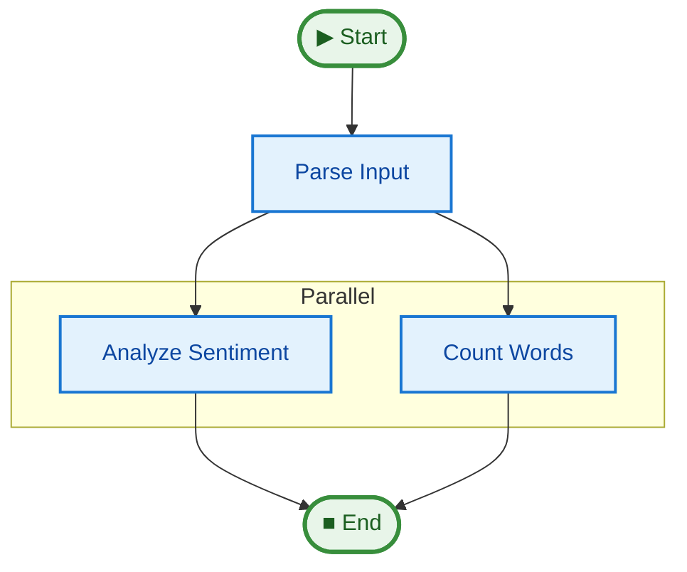

# [12 Observability](../README.md#production-reliability)

Monitor, debug, and analyze pipeline execution with justpipe's comprehensive observability features.

## Key Concepts

1. **Real-time Logging**: EventLogger for colored console output with configurable log levels
2. **Persistent Storage**: SQLite and in-memory storage for persisting pipeline runs
3. **Performance Metrics**: MetricsCollector for tracking duration and identifying bottlenecks
4. **Timeline Visualization**: ASCII, HTML, and Mermaid timeline diagrams
5. **CLI Tools**: Query and analyze runs from the command line
6. **Replay & Compare**: Reproduce runs and compare performance differences

## Quick Start

From the project root:

```bash
uv run python examples/12_observability/main.py
```

This runs a comprehensive demo showing all observability features in action.

## Examples

- **main.py** - Comprehensive overview of all observability features (start here!)
- **observers_demo.py** - Basic observability (EventLogger, StorageObserver, BarrierDebugger)
- **metrics_demo.py** - Metrics and visualization (MetricsCollector, TimelineVisualizer, StateDiffTracker)
- **replay_demo.py** - Replay and comparison (ReplayObserver, compare_runs)
- **cli_workflow_demo.py** - Generate test data for CLI commands

## Key Features Demonstrated

### Basic Observability (observers_demo.py)
- **debug=True Parameter**: Simplest way to enable observability
- **EventLogger**: Real-time colored console output
- **StorageObserver**: Persist runs to SQLite for later analysis
- **BarrierDebugger**: Detect hanging parallel execution
- **Multiple Observers**: Combine different observers together

### Metrics & Visualization (metrics_demo.py)
- **MetricsCollector**: Track performance and identify bottlenecks
- **TimelineVisualizer**: Generate ASCII, HTML, and Mermaid diagrams
- **StateDiffTracker**: Track state changes across pipeline steps
- **CLI Integration**: Query runs with `justpipe list`, `show`, `timeline`

### Replay & Compare (replay_demo.py)
- **ReplayObserver**: Reproduce runs with exact same initial state
- **compare_runs()**: Compare two runs to identify differences
- **Export**: Export run data to JSON for external analysis
- **CLI Compare**: Use `justpipe compare` to find performance regressions

## Expected Output

```text
======================================================================
JUSTPIPE OBSERVABILITY DEMO
======================================================================

Running pipeline with observability enabled...
Input: 'This is a great example of pipeline observability'

[00:00:00.001] START            system
[00:00:00.002] STEP_START       parse_input
[00:00:00.012] STEP_END         parse_input
[00:00:00.013] STEP_START       count_words
[00:00:00.033] STEP_END         count_words
[00:00:00.034] STEP_START       analyze_sentiment
[00:00:00.049] STEP_END         analyze_sentiment
[00:00:00.050] FINISH           system (status=success)

======================================================================
RESULTS
======================================================================

Final State:
  Parsed: THIS IS A GREAT EXAMPLE OF PIPELINE OBSERVABILITY
  Word Count: 8
  Sentiment: positive

Performance Metrics:
  Total Duration: 0.049s
  Total Steps: 3
  Bottleneck: count_words

Stored in Database:
  Run ID: a1b2c3d4e5f6...
  Storage: ~/.justpipe

Timeline saved to: timeline.txt

======================================================================
CLI COMMANDS
======================================================================

Query this run with CLI commands:
  justpipe show a1b2c3d4
  justpipe timeline a1b2c3d4
  justpipe export a1b2c3d4

List all runs:
  justpipe list
  justpipe list --pipeline document_processor
  justpipe list --status success
```

## API Reference

### Observer Pattern

```python
from justpipe.observability import Observer

class MyObserver(Observer):
    async def on_pipeline_start(self, state, context):
        """Called before pipeline execution starts."""
        pass

    async def on_event(self, event: Event, state):
        """Called for each event during execution."""
        pass

    async def on_pipeline_end(self, state, duration: float):
        """Called after pipeline completes successfully."""
        pass

    async def on_pipeline_error(self, error: Exception, state):
        """Called when pipeline fails."""
        pass
```

### EventLogger

```python
from justpipe.observability import EventLogger

# Configure log level
logger = EventLogger(
    level="INFO",      # DEBUG, INFO, WARNING, ERROR
    stream=sys.stderr, # Output stream
    use_colors=True    # Enable ANSI colors
)

pipe.add_observer(logger)
```

### SQLite Storage

```python
from justpipe.storage import SQLiteStorage

storage = SQLiteStorage("~/.justpipe")

# Create run
run_id = await storage.create_run("my_pipeline")

# Add events
await storage.add_event(run_id, event)

# Query runs
runs = await storage.list_runs(
    pipeline_name="my_pipeline",
    status="success",
    limit=100
)

# Get events
events = await storage.get_events(run_id)

# Delete run
await storage.delete_run(run_id)
```

### StorageObserver

```python
from justpipe.observability import StorageObserver

observer = StorageObserver(
    storage,
    save_initial_state=True,  # Save state as artifact
    pipeline_name="custom_name"  # Override pipeline name
)

pipe.add_observer(observer)

# After run
run_id = observer.get_run_id()
```

### BarrierDebugger

```python
from justpipe.observability import BarrierDebugger

debugger = BarrierDebugger(
    warn_after=10.0,   # Warning threshold in seconds
    stream=sys.stderr  # Output stream
)

pipe.add_observer(debugger)
```

## Event Types

The observability system tracks the following event types:

- **Pipeline Lifecycle**: `START`, `FINISH`, `SUSPEND` (FINISH carries structured status; schema version in `EVENT_SCHEMA_VERSION`)
- **Step Execution**: `STEP_START`, `STEP_END`, `STEP_ERROR`, `TOKEN`
- **Parallel Execution**: `BARRIER_WAIT`, `BARRIER_RELEASE`, `MAP_START`, `MAP_WORKER`, `MAP_COMPLETE`
- **State Tracking**: `STATE_CHANGE`

## Storage Structure

When using SQLiteStorage, data is stored in:

```
~/.justpipe/
├── runs.db              # SQLite database
│   ├── runs table       # Pipeline run metadata
│   └── events table     # Event stream
└── artifacts/
    └── <run_id>/
        └── initial_state.json
```

## Query Examples

### List Recent Runs
```python
runs = await storage.list_runs(limit=10)
for run in runs:
    print(f"{run.id}: {run.status} ({run.duration:.2f}s)")
```

### Filter by Status
```python
failed_runs = await storage.list_runs(status="error")
```

### Get Run Events
```python
events = await storage.get_events(run_id)
for event in events:
    print(f"[{event.timestamp}] {event.event_type}: {event.step_name}")
```

### Filter Events by Type
```python
from justpipe import EventType

errors = await storage.get_events(
    run_id,
    event_types=[EventType.STEP_ERROR]
)
```

## Performance Impact

With all observers enabled:
- **EventLogger**: ~1-2% overhead
- **StorageObserver**: ~3-5% overhead
- **BarrierDebugger**: <1% overhead

**Total**: <10% overhead

Observers are optional and have zero overhead when not used.

## See Also

- **PRD**: `PRD-Observability.md` - Full product requirements
- **Tests**: `tests/unit/test_observability.py` - Comprehensive test suite
- **CLI README**: `justpipe/cli/README.md` - CLI commands documentation

## Pipeline Graph



## See Also

- **[14 Testing Harness](../14_testing_harness)**: Use observability concepts in your unit tests.
- **[09 Middleware](../09_middleware)**: Build custom loggers.
