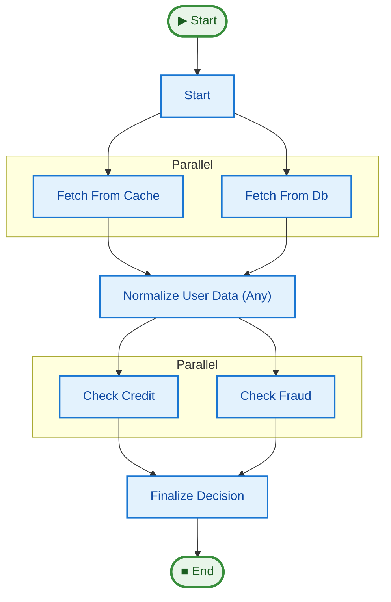

# Barrier Types (Fan-In Control)

This example demonstrates how to control step execution behavior when multiple dependencies (parents) are involved.

## Concepts

### `BarrierType.ALL` (Default)
The standard "AND-Join". The step waits for **all** incoming connections to complete before running.
- **Use Case:** Aggregating results, ensuring all preconditions are met (e.g., "Wait for payment AND inventory check").

### `BarrierType.ANY` (OR-Join)
The "First-to-Finish" pattern. The step runs as soon as **any one** of the incoming connections completes.
- **Behavior:**
    - Triggers immediately on the first completion.
    - Subsequent completions from other parents are **ignored** for the current execution wave (they won't trigger the step again).
- **Use Case:**
    - **Racing:** Querying multiple redundant APIs/databases and taking the fastest response.
    - **Fast Path:** Proceeding with partial data if one source is much faster.
    - **Redundancy:** Implementing "Backup" logic where a second task runs in parallel but the main flow proceeds if the primary succeeds first.

## The Example Pipeline

1.  **Race (ANY):** `fetch_from_cache` and `fetch_from_db` run in parallel. `normalize_user_data` listens to both with `BarrierType.ANY`. It proceeds as soon as the fastest one finishes.
2.  **Aggregation (ALL):** `check_fraud` and `check_credit` run in parallel. `finalize_decision` waits for **both** (`BarrierType.ALL`) before making the final approval.

## Pipeline Graph

