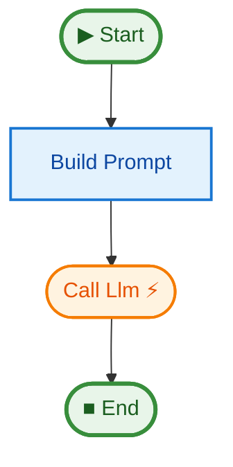

# [15 Real LLM Streaming](../README.md#ai--streaming)

This example demonstrates a production-style LLM streaming pipeline with automatic mock fallback when no API key is set.

## Key Concepts

1.  **Real API Integration**: Uses OpenAI's streaming API when `OPENAI_API_KEY` is set.
2.  **Mock Fallback**: Automatically falls back to a mock LLM when no key is present, making the example runnable anywhere.
3.  **Token Streaming**: The `call_llm` step is an async generator that `yield`s tokens as they arrive.
4.  **State Accumulation**: Tokens are collected in `state.tokens` and joined into `state.response`.
5.  **TestPipe Integration**: Includes an inline test showing how to mock the LLM step with `TestPipe`.

## How to Run

1.  (Optional) Set your OpenAI API key:
    ```bash
    export OPENAI_API_KEY="sk-..."
    ```
    *If not set, the example runs in mock mode.*

2.  Run the example:
    ```bash
    uv run python examples/15_real_llm_streaming/main.py
    ```

## Expected Output (Mock Mode)

```text
[Mock] Streaming response:

Python is a versatile, high-level programming language known for ...

--- Done (25 tokens) ---
Graph saved to .../pipeline.mmd

Test passed!
```

## Pipeline Graph



## See Also

- **[07 Streaming](../07_streaming)**: Basic streaming pattern with OpenAI.
- **[14 Testing Harness](../14_testing_harness)**: More `TestPipe` usage patterns.
