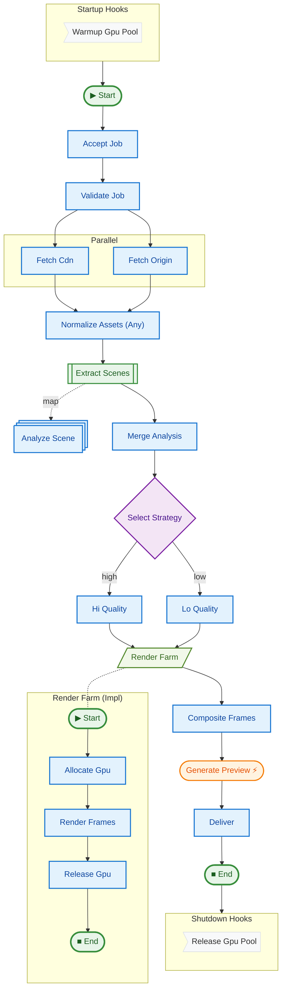

# [16 Dashboard Showcase](../README.md#production-reliability)

A comprehensive example that exercises every dashboard feature through a cloud video rendering pipeline with three contrasting scenarios.

## Key Concepts

1.  **Full Node Coverage**: Uses all 5 node kinds — step, map, switch, sub-pipeline, and barrier.
2.  **Meta Protocol**: Demonstrates all three meta scopes (`step`, `run`, `pipeline`).
3.  **Persistence**: Writes runs to SQLite via `persist=True` for dashboard consumption.
4.  **Scenario Comparison**: Runs 3 scenarios (fast success, retry recovery, timeout failure) for side-by-side comparison.
5.  **Sub-pipelines**: Nests a GPU render farm pipeline inside the main video pipeline.
6.  **Barrier Types**: Uses both `ANY` (asset fetch race) and `ALL` (analysis merge, frame compositing) barriers.
7.  **Streaming Tokens**: Preview generation yields tokens for real-time replay.

## How to Run

```bash
uv run python examples/16_dashboard_showcase/main.py
```

Then launch the dashboard:

```bash
JUSTPIPE_STORAGE_PATH=/tmp/justpipe_showcase uv run justpipe dashboard
```

## Expected Output

```text
======================================================================
VIDEO RENDER PIPELINE - Dashboard Showcase
======================================================================

  Running: Quick Promo (Summer Promo 2026)
    -> SUCCESS in 0.xxs (run: ...)

  Running: Feature Film (The Last Algorithm)
    -> SUCCESS in 0.xxs (run: ...)

  Running: Deadline Crunch (Q4 Launch Trailer)
    -> TIMEOUT in 0.xxs (run: ...)

======================================================================
RESULTS
======================================================================

  [+] Quick Promo            success     ...
  [+] Feature Film           success     ...
  [x] Deadline Crunch        timeout     ...
```

## Pipeline Graph



## See Also

- **[12 Observability](../12_observability)**: Foundational observability concepts used here.
- **[13 Barrier Types](../13_barrier_types)**: Deep dive into ANY vs ALL barriers.
- **[06 Sub-pipelines](../06_subpipelines)**: Sub-pipeline composition pattern.
